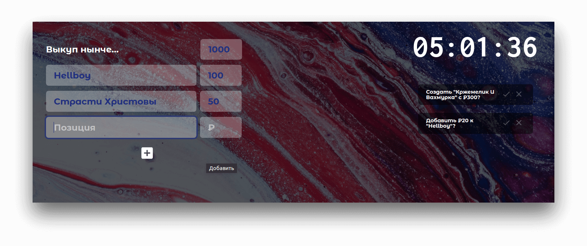

# Auction

Simple auction tool, primarily for streamers.

This repository contains all sourse files: 

frontend HTML + CSS, JS and the backend is running on Python (Django).

# Usage

Just deploy your local Django server by manage.py.

Or if you're not programmer, just use [link](https://woodsauc.pythonanywhere.com).

# Info

Developer: [@ceigh](https://gitlab.com/ceigh 'Artjom Löbsack').

If you want to help the project, please [donate](https://www.donationalerts.com/r/hecig).

Or if you're developer, please fork, send merge request or mark an issue.
